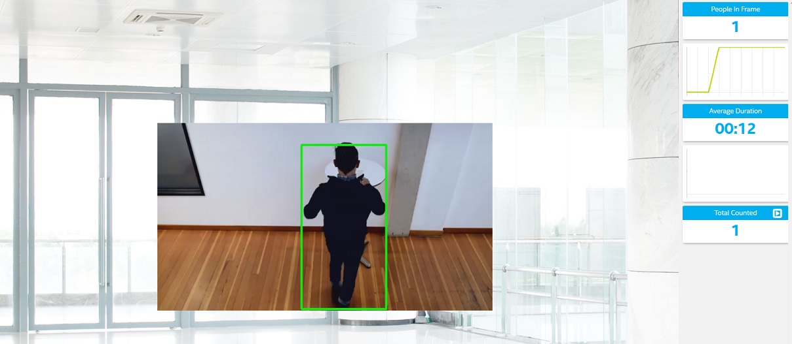
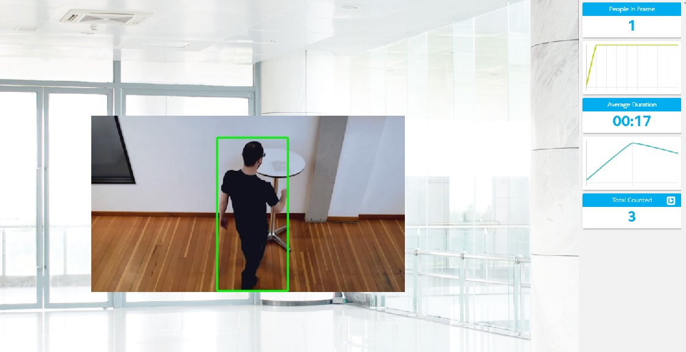
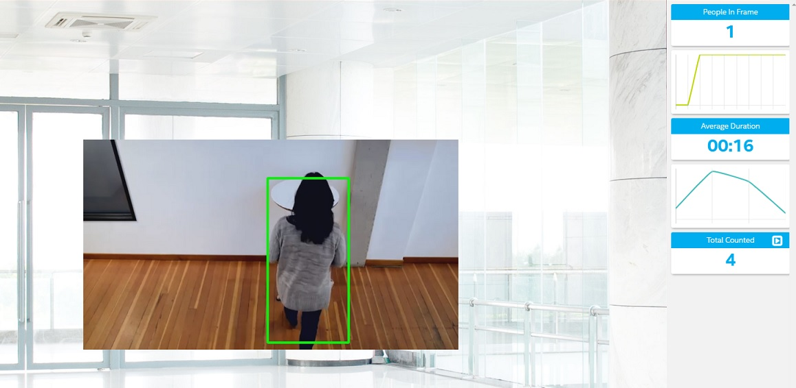
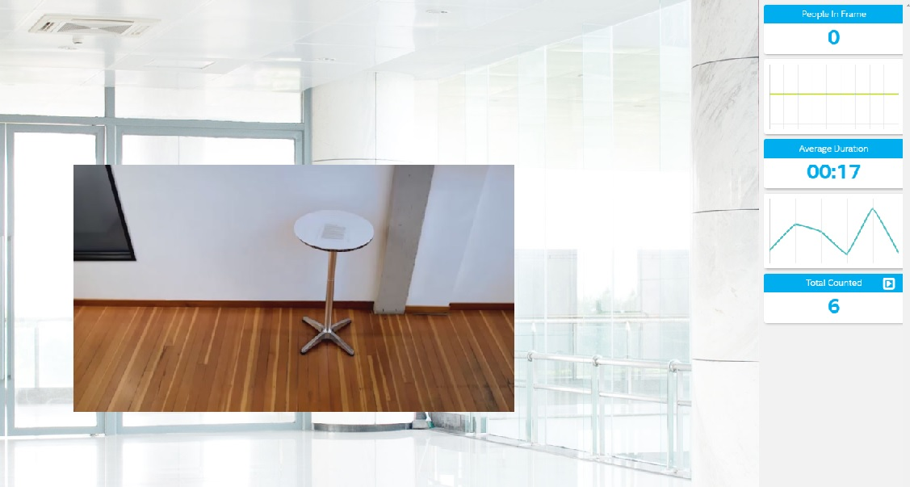

# Report


## Explaining Custom Layers and model selection

I've selected from the [Tensorflow Object Detection Model Zoo](https://github.com/tensorflow/models/blob/master/research/object_detection/g3doc/detection_model_zoo.md). I selected:

* [faster_rcnn_inception_v2_coco](http://download.tensorflow.org/models/object_detection/faster_rcnn_inception_v2_coco_2018_01_28.tar.gz)

The Faster-RCNN model give us a good detection and very good accuracy. Others models like SSD_inception_v2_coco was used but discarted by not satisfactory result detecting people in the .mp4 example.

OpenVINO already contains extensions for custom layers used in [Tensorflow Object Detection Model Zoo]

The model cannot be one of the existing Intermediate Representations provided by Intel®.Thus we need convert TF model to OpenVINO IR format is given below:
```
python /opt/intel/openvino/deployment_tools/model_optimizer/mo.py --input_model model/faster_rcnn_inception_v2_coco/frozen_inference_graph.pb --tensorflow_object_detection_api_pipeline_config pipeline.config --reverse_input_channels --tensorflow_use_custom_operations_config /opt/intel/openvino/deployment_tools/model_optimizer/extensions/front/tf/faster_rcnn_support.json
```


## Comparing Model Performance

Comparing with the previous selection (SSD_inception_v2_coco), the first model does not works correctly and it was imposible count correctly the people in the frame.


## Assess Model Use Cases

This types of application could be very useful actually, due to the restrictions of people movements (due to COVID-19) one of the potential uses could be control the acces at common zones in offices, bank offices, etc... 

Other useful application could be the control of work zones where only one people must be in the zone and the other workers must be outside the work zone. For example, in zones with highly risk of explosion. 

Other is in retail, the control of the people and the time inside the shop could be important in order to select the exposition and other issues.


## Effects on End User Needs


 - Lighting - This model didn't affected by the lighting especially with the test video, so this video have a good light, we should take in account in other models and other video inputs the light will be important in order to obtain a good result.

* Camera focal length/image size - we used an video size of 768x462 and framerate of 24, enough to obtain a correct result with the model selected. 


## Application Run

I ran the application in Udacity workspace following the instructions in guide.ipynb and writing in the last terminal the follow intruction:

```
python main.py -i resources/Pedestrian_Detect_2_1_1.mp4 -m model/faster_rcnn_inception_v2_coco/frozen_inference_graph.xml -l /opt/intel/openvino/deployment_tools/inference_engine/lib/intel64/libcpu_extension_sse4.so -d CPU -pt 0.4 | ffmpeg -v warning -f rawvideo -pixel_format bgr24 -video_size 768x432 -framerate 24 -i - http://0.0.0.0:3004/fac.ffm
```
Screenshot of APP launched 







## Final Result




